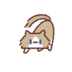

<div align="center">

# 🐱 月薪喵桌宠 · Yuexin Miao Desktop Pet


**一只住在你屏幕角落的小猫——会看时间换表情、定时提醒你喝水休息、偶尔像屏保气泡一样满屏溜达。**

A tiny cat that lives in the corner of your screen — changes its mood by time of day,
nudges you to drink water & stretch, and occasionally wanders around like a DVD screensaver.


</div>

---

## ✨ 它能做什么

- 🛋️ **趴在角落卖萌** — 透明、始终置顶、**点击穿透**（完全不挡你操作鼠标）。
- 🕑 **按时间段换动作** — 白天活泼、傍晚放松、深夜熬夜看电脑/睡觉，每隔几分钟自动换一个待机表情，像真的养了一只。
- 💧 **定时提醒（喝水 / 久坐）** — 到点小猫**跳出来走两步 → 停下举个小气泡说话 → 收起 → 再走**，绝不边走边晃让你看不清字。
- 🫧 **随机漫游（卖萌彩蛋）** — 像老式 DVD / 气泡屏保那样在桌面慢慢飘、碰边反弹。**可单独关掉**（开会/共享屏幕时不打扰别人）。
- 🖐️ **能一把抓起来拖** — 想放哪放哪，松手自己缓缓溜回角落。
- ⚙️ **设置面板** — 喝水、久坐、随机漫游、换动作各自独立开关 + 调间隔，保存**立即生效**、重启也记得。
- 🪶 **零运行时依赖** — 纯 Electron，连动画都用浏览器原生播放，体积小、好读、好改。

## 🎬 它的不同状态

平时趴角落，按当前时间段在对应的"动作池"里随机切换：

| ☀️ 白天 (6:00–18:00) | 🌆 傍晚 (18:00–23:00) | 🌙 深夜 (23:00–6:00) |
|:---:|:---:|:---:|
| <br>拍照 | <br>趴着 | <br>半夜看电脑 |
| <br>挠头 | <br>摆手 | <br>睡觉 |
| <br>跳跃 | <br>困 | <br>困 |

> 时间段和每个池子里有哪些动作，都在 `settings.json` 的 `schedule` 里配置，随便调。

## 📦 安装使用

### 普通用户
到 [Releases](../../releases) 下载对应安装包：
- **Windows**：`YuexinCatPet-Setup-x.y.z.exe`，双击安装（绿色一键，免管理员）。
- **macOS**：`YuexinCatPet-x.y.z.dmg`，拖进「应用程序」即可。

装好后小猫出现在屏幕右下角；菜单栏 / 系统托盘有它的图标，右键可开**设置**、暂停乱跑、退出。

### 从源码运行 / 自己构建（macOS 或 Windows）
```bash
npm install              # 只装 electron + electron-builder
npm start                # 本机预览
npm run dist             # 打 Windows 安装包  -> dist/*.exe
npm run dist:mac         # 打 macOS .dmg (universal)
```
国内网络给二进制下载加镜像：
```bash
export ELECTRON_MIRROR="https://npmmirror.com/mirrors/electron/"
export ELECTRON_BUILDER_BINARIES_MIRROR="https://npmmirror.com/mirrors/electron-builder-binaries/"
```

## 🛠️ 加你自己的动作 / 表情

想给猫加新表情，三步：
1. 把一个 GIF 丢进 `assets/source/actions/`，文件名用英文（如 `stretch.gif`）。
2. 跑 `npm run assets`（需要 `python3` + `Pillow`）——自动抠图生成 `assets/actions/stretch/{cat.webp, mask.png}`，自带透明背景的会自动抠图，纯色背景的会原样保留。
3. 在 `settings.json` 的 `schedule.<时段>.actions` 里加上 `"stretch"`。

完成，下次进入那个时段就会随机抽到它。

## 🧩 工作原理（给想改的人）

一个中央**行为状态机** (`src/main/behavior.js`) 协调四种状态，按优先级抢占，保证任意时刻只有一个动作在跑：

```
DRAG（拖拽） > REMIND（提醒走停弹气泡） > ROAM（随机漫游） > IDLE（趴窝换动作）
```

- 移动算法在 `src/main/wander.js`（`easeTo` 缓动回角落 + `dvdRoam` 碰边反弹）。
- 命中检测用每个动作自己的剪影 `mask.png` 逐像素判断光标在不在猫身上（透明区穿透、猫身可拖）。
- 完整架构 + 数据流图见 [`docs/ARCHITECTURE.md`](docs/ARCHITECTURE.md)。

调参用环境变量（自测把间隔调短）：
`PET_WATER_MS` / `PET_STANDUP_MS` / `PET_ROAM_EVERY_MS` / `PET_ROAM_DUR_MS` / `PET_IDLE_SWITCH_MS` / `PET_REMIND_WALK_MS` / `PET_REMIND_BUBBLE_MS`。

## 🧱 技术栈
- [Electron 42](https://www.electronjs.org/) — 透明窗口 / 点击穿透 / 托盘 / 开机自启
- [electron-builder 26](https://www.electron.build/) — NSIS (Windows) + dmg (macOS)
- Python + [Pillow](https://python-pillow.org/) — 素材管线（GIF → 动画 WebP + 命中剪影），仅构建期用

## 🙏 致谢 & 版权

猫咪角色「**月薪喵**」动图来自其原作者的创作，**版权归原作者所有**。本项目是粉丝向的桌宠小工具，素材仅用于演示。

> ⚠️ 本仓库的 **MIT 许可只覆盖源代码**，不覆盖 `assets/` 下的猫咪美术素材。若你 fork 或二次分发，请**替换成你自己的素材**或取得原作者授权。详见 [LICENSE](LICENSE)。

## 📄 License
[MIT](LICENSE) © 2026 zzx — 代码部分。美术素材见上方说明。
